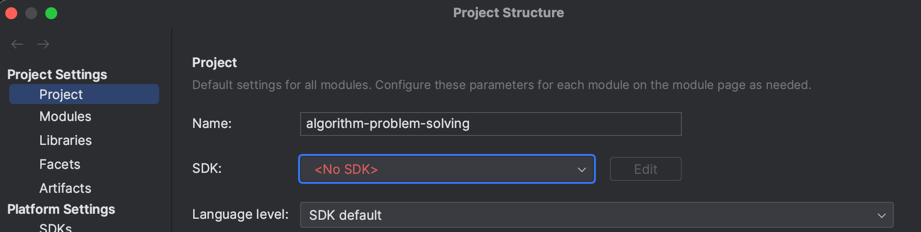
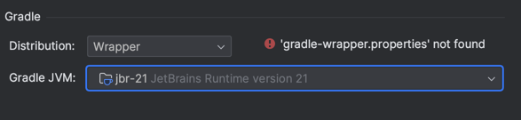
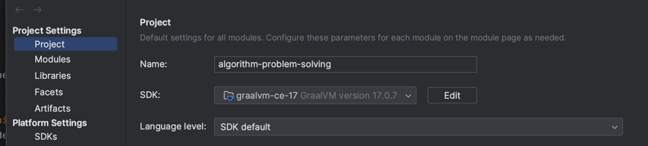
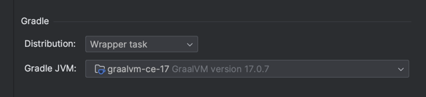

## 키워드

- Build(빌드)
- Java(자바)
- Gradle(그레이들)
- IntelliJ(인텔리제이)

## 발생 시점

Java 프로젝트 생성 후 gradle build 시 발생

## 발생 에러

```shell
Could not open init generic class cache for initialization script '/private/var/folders/2n/nxyqnsyx3n32w1ypjjwfcy0h0000gn/T/wrapper_init6.gradle' (/Users/hyoguoo/.gradle/caches/8.0/scripts/2gin8x71zjbgd7c7m48oqy7p4).
> BUG! exception in phase 'semantic analysis' in source unit '_BuildScript_' Unsupported class file major version 65
```

## 해결 방법

### AS-IS





### TO-BE



